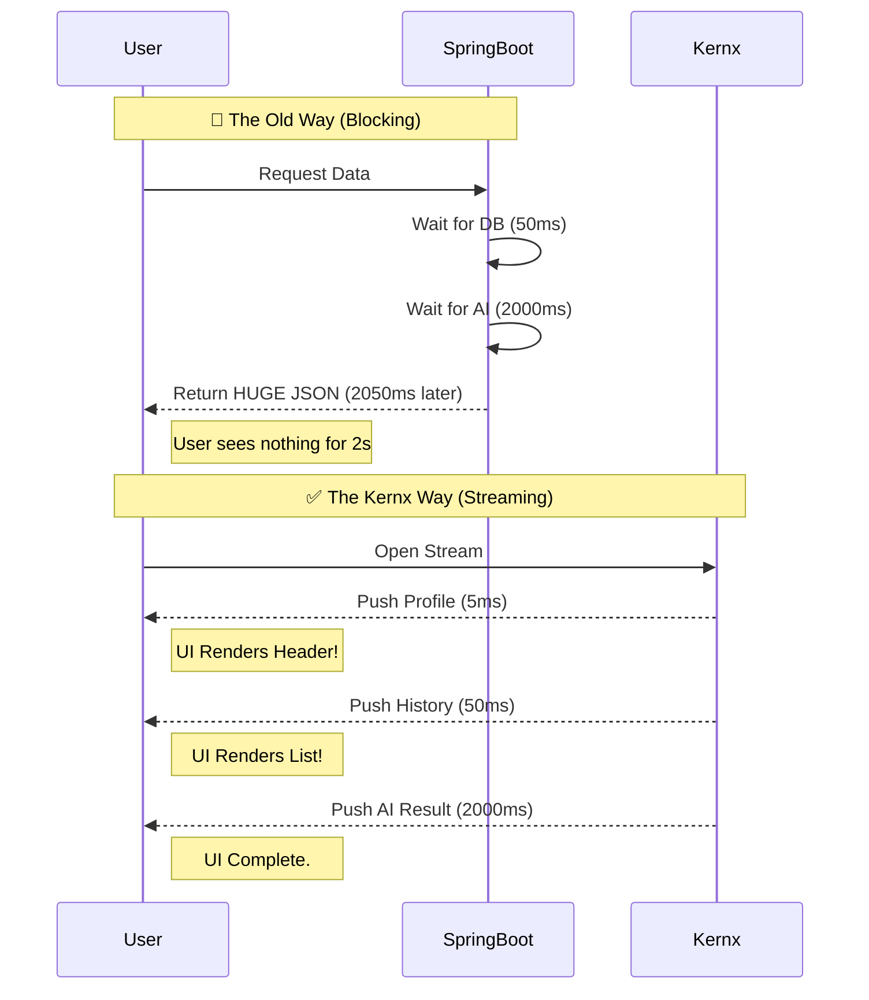

# 📜 The Kernx Manifesto

**"The user should never wait for the slowest byte."**

We are building Kernx because we believe the current backend architecture is fundamentally limiting the web.
For 15 years, we have treated data as **Blocks**. We fetch it, bundle it, and ship it.
If 999 attributes are ready, but the 1,000th attribute is slow, the backend blocks the entire request.

**This is a lie.** The data exists. The network is open. The only thing stopping the user from receiving those 999 attributes is our **Thread-Per-Request** architecture.

---

## 🚫 The Problem: "The Block" (Traditional Architectures)

In the standard model (e.g., Spring Boot / Servlet), a Request is an atomic transaction tied to a heavy OS thread.
1.  **Client:** "Give me the Dashboard."
2.  **Server:** *Thread Blocks... (Fetching User Profile: 5ms)*
3.  **Server:** *Thread Blocks... (Fetching Order History: 50ms)*
4.  **Server:** *Thread Blocks... (Calculating AI Recommendations: 2000ms)*
5.  **Server:** "Here is your 5MB JSON blob." (Total Time: 2055ms)

**The Cost:** Holding a connection open for 2 seconds consumes ~2MB of RAM per user. To stream to 100,000 users, you would need 200GB of RAM just for thread stacks.

**Result:** We bundle data to save the *server*, not to help the *user*.

---

## ⚡ The Solution: "The Actor Kernel" (Kernx)

Kernx flips the model. It uses **Virtual Threads** and **Actors**, meaning a connection costs effectively **zero RAM**.
This allows the backend to hold 100,000 connections open indefinitely, pushing data the instant it is computed.

### Visual Comparison

**The Difference:**

We do not render the UI. We provide the **Concurrency Primitive** that makes streaming APIs possible at scale.

* **Spring Boot** streams 100 users → Server OK.
* **Spring Boot** streams 10,000 users → `OutOfMemoryError` (Thread exhaustion).
* **Kernx** streams 1,000,000 users → **CPU Idle.**
* **We call it The Pixel Stream Architecture.**

---

## 🎯 Concrete Use Cases

### 1. The "Live" Dashboard 📊

**Scenario:** A crypto trading terminal.

* **Old Way:** Poll the API every 1 second. (Laggy, heavy load).
* **Kernx Way:** One open connection. The Price Actor pushes updates only when the price actually changes.
* **Result:** Zero latency, 99% less bandwidth.

### 2. The "Thinking" AI Agent 🤖

**Scenario:** A Chatbot that needs to browse the web before answering.

* **Old Way:** User stares at a spinner for 10 seconds while the backend does `web_search()`.
* **Kernx Way:** The Agent pushes "I am searching Google..." → "Found 3 results..." → "Reading page..." → "Here is the answer."
* **Result:** The user feels the "Thinking Process" instantly.

### 3. The Multiplayer Game State 🎮

**Scenario:** 100 players in a lobby.

* **Old Way:** Re-fetch the entire lobby list every 5 seconds.
* **Kernx Way:** The Lobby Actor holds the state in RAM. When Player A joins, it pushes only `{"event": "JOIN", "user": "A"}` to the other 99 players.
* **Result:** Real-time sync with minimal CPU usage.

---

## 🛠 Our Principles

### 1. Granular Concurrency (Actors)

Every entity (User, Device, Order) is an isolated **Actor**. They process independently. One slow Actor never blocks the rest of the system.

### 2. Single Writer (No Locks)

We do not use `synchronized` blocks. We use **Lock-Free Queues (MPSC)**. Data belongs to **one** Actor at a time. This eliminates race conditions by design.

### 3. Asynchronous by Default

The "State" of the application is not a static row in a database. It is a living, breathing entity in memory that pushes updates to the world.

---
## 🛡️ The Security Doctrine: The Sovereign Shield

We believe the **Shield is more powerful than the Sword.**

In the current internet, servers are passive victims. They are built to "listen" to anyone who shouts. If an attacker shouts loud enough (DDoS), the server collapses. The Sword wins.

**Kernx changes the physics of the battlefield.**

### 1. Control What You Hear
A traditional server exposes an open door. Kernx exposes a **Single-File Line** (The Queue).
* **The Sword** swings wildly at the system.
* **The Shield** (Kernx) decides exactly which messages to pull from the queue.
* If the traffic is garbage, we do not even allocate memory for it. We drop it at the gate. We only "hear" what we choose to validate.

### 2. Collapse the Attack Surface
When you run 100 microservices, you have 100 doors to defend.
When you run **One Kernel**, you have **One Shield**.
By centralizing state and logic into a single, deterministic engine, you shrink your attack surface from "The Entire Cloud" to "A Single Mailbox."

### 3. Defiance: Refuse to be Rushed
Most systems panic under load. They try to process faster and die trying.
**Kernx is Defiant.** "Refusing to be rushed" is our stance against DDoS. We process at *our* max speed, not the attacker's desired speed. If you flood us, you don't crash us—you just wait.

### 4. Mathematical Truth: The Law of Backpressure
We rely on physics, not hope.
**Backpressure**—refusing to accept more work than you can handle—is the **only mathematically proven way** to survive a flood.

*Example:* If your queue holds 10,000 messages and can process 1,000/sec, you drain in 10 seconds. A flood of 1,000,000 messages doesn't crash you—999,000 requests simply wait outside the gate.

We do not guess. We simply close the gate when the buffer is full. The Shield holds because the math says it must.

**An attacker cannot overwhelm a system that refuses to be rushed.**

**The Sword exhausts itself against the Shield.**

**If you flood us, you don't crash us—you just wait.**

---

## ⚖️ **The Ethical Stance**

---

### **1. The Shield for the Unprotected**

For too long, "high availability" meant high cost. DDoS protection was a CloudFlare subscription. Real-time trading required a hedge fund's infrastructure budget. The ability to **stay online under attack** was reserved for those who could afford it.

**Kernx changes that.**

A hospital running on Kernx can survive a DDoS attack on commodity hardware. A solo developer building a crypto exchange can match the throughput of Coinbase's early infrastructure—**on a laptop.**

We're not here to destroy the cloud giants. We're here to **arm the rebels**.

When efficiency becomes accessible, it stops being a competitive moat and becomes a **fundamental right**. If you can code, you can compete.

---

### **2. The End of Artificial Complexity**

Let's be honest: much of "distributed systems engineering" is managing problems we invented.

You don't *need* an API Gateway + Load Balancer + Service Mesh + Kubernetes + Consul + Prometheus just to route HTTP requests. That's six layers of abstraction solving a problem that a **single kernel** solves in nanoseconds.

**Kernx collapses that stack.**

Will this disrupt roles? Yes. The "Performance Optimization Engineer" who spends weeks tuning thread pools will need to evolve. They'll become the **System Architect** who designs *what* to build with all that freed-up time.

This is not a bug. It's the point.

**We believe value lies in solving problems, not in wrestling with infrastructure.**

---

### **3. The Horizon**

History repeats: The compiler didn't end programming—it ended punch cards. The cloud didn't end sysadmins—it ended racking servers in closets. Docker didn't kill ops—it killed snowflake deployments.

**Every leap in efficiency eliminated toil, not work.**

Kernx does the same. When you can handle 83k req/sec without tuning, you stop maintaining the machine and start building the future.

We're not eliminating roles. We're **clearing the brush** so new industries can grow.

---

### ***The Asterisk**

We acknowledge centralization has risks. That's why Kernx is **Source Available** (BSL 1.1). You control the kernel. You audit the code. You own your infrastructure.

**You're not trading one master for another.**

---

**Efficiency is not a luxury. It's leverage.**

**And leverage, when shared, becomes freedom.**

---

**We are building the Engine.**

**You build the Future.**

---

Ultimately, we chase efficiency for one simple reason: **To stop fighting fires, go home at 5, and spend time with the ones we love.**