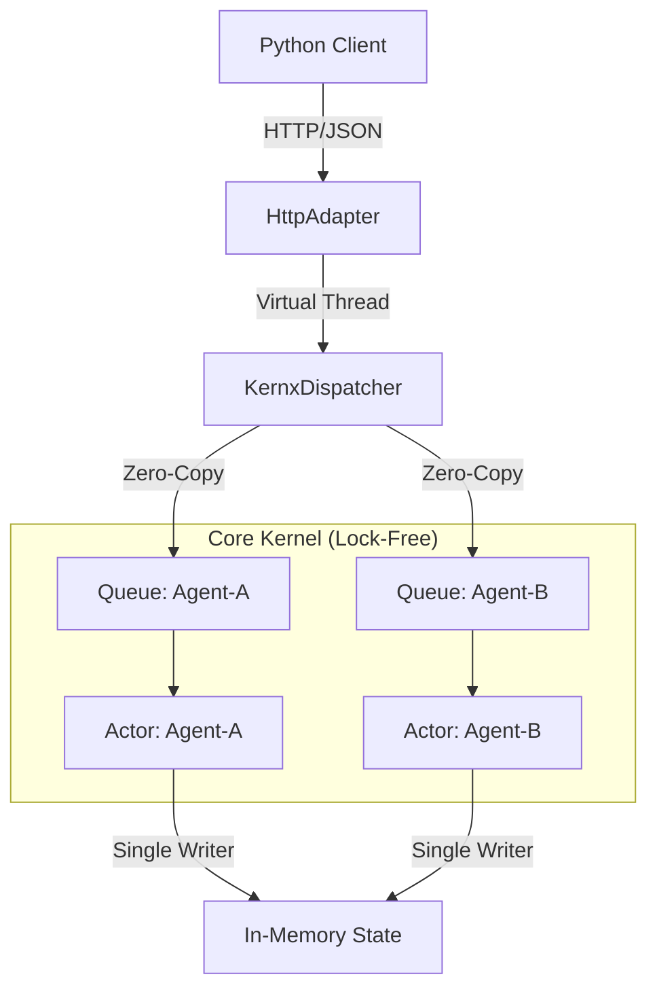

# ⚡ Kernx: The Deterministic AI Kernel


-orange)


**Stop orchestrating. Start computing.**

Kernx is a high-performance, deterministic execution engine for massive swarms of AI Agents. It replaces complex microservice meshes, sidecars, and distributed locks with a single, ultra-fast Java 25 Kernel.

It is designed to solve **The Concurrency Problem**: How do you run 1,000,000 stateful agents without deadlocks or race conditions?

---

## 🏗️ Architecture

Kernx uses a **"Fan-In" Architecture**. Thousands of concurrent HTTP requests are funneled into ultra-fast, lock-free memory queues.



---

## 🚀 Why Kernx?

| Feature | The Old Way (Microservices) | The Kernx Way |
| :--- | :--- | :--- |
| **Concurrency** | 1 Thread = 1 Request (Heavy) | **Virtual Threads** (1M+ Agents on 1 CPU) |
| **Communication** | Network Calls (Slow, 5ms+) | **Memory Queues** (Instant, Nanoseconds) |
| **Data Integrity** | Optimistic Locking (Retries) | **Single Writer Principle** (Zero Locks) |
| **Security** | Firewalls at the Edge | **Deep Packet Inspection (DPI)** in Core |

---

> [!WARNING]
> **STRICT REQUIREMENT: JAVA 25 (PREVIEW)**
>
> Kernx utilizes "Bleeding Edge" Virtual Thread features available only in **Java 25**.
> * Attempting to run on **Java 21, 17, or 8** will fail instantly with `UnsupportedClassVersionError`.
> * You must enable preview features: `java --enable-preview -jar release/kernx-engine.jar`

---

## 📦 Quick Start (No Build Required)

We have bundled the compiled kernel so you can run it instantly.

### 1. Ignite the Engine (Terminal A)

Keep this terminal open.

```bash
java --enable-preview -jar release/kernx-engine.jar
```

**Output:** `[INFO] 🌍 HTTP Adapter listening on http://localhost:8080`

### 2. Feel the Heartbeat (Terminal B)

Verify the system is alive using our built-in monitor.

```bash
pip install requests
python3 heartbeat.py
```

**Output:** `[T+1s] THROUGHPUT: 24,500 req/s | STATUS: ALIVE`

---

## 🐍 Python SDK

**Are you an AI Engineer or Data Scientist?**

👉 **[Read the Python SDK Documentation](sdk/python/README.md)**

We have a dedicated guide for you that skips the Java build process.

---

## 🛡️ Security: "War Mode"

Kernx includes a Layer 7 Firewall inside the application kernel.

Deep Packet Inspection (DPI) allows you to block threats dynamically without restarting.

```python
# Enable War Mode
k.config("dpi_mode", "ON")

# Block a specific Hex Signature
k.block_hex("CAFEBABE") 
```

---

## 📊 Benchmarks (The "Widowmaker" Test)

Tested on Apple Silicon M1 (100,000 concurrent requests):

```
⏱️  Time: 1513 ms
📨 Throughput: 66,093 req/sec
✅ Accepted: 100,000
⛔ Rejected: 0
```

---

## 📂 Project Structure

```plaintext
kernx-root/
├── release/
│   └── kernx-engine.jar  # The Pre-Built Binary
├── sdk/                  # Client Libraries
│   └── python/           # The Python Driver
├── kernx-core/           # The Java Source
├── heartbeat.py          # Vital Signs Monitor
└── MANIFESTO.md          # The Philosophy
```

---

## © License

**Business Source License 1.1**

* Free for development and non-production use.
* Production use requires a license key (contact sales@kernx.io).
* Code becomes Open Source (Apache 2.0) after 4 years.