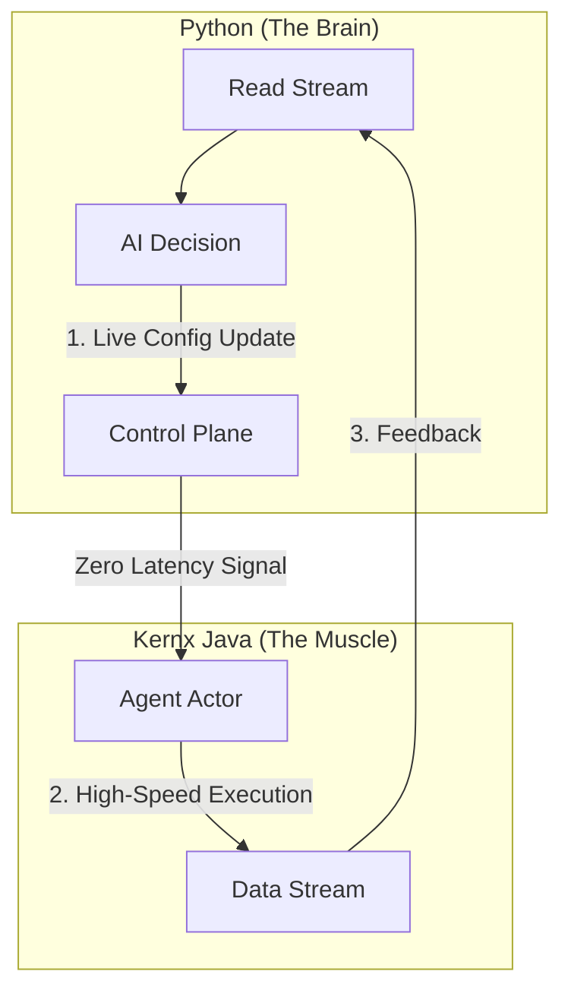

# 🐍 Kernx Python SDK

**The Remote Control for the World's Fastest AI Kernel.**

This SDK allows standard Python scripts to drive the **Kernx Java Engine**.
You write the logic in Python (Agents, AI, Business Rules).
Kernx handles the concurrency (100k+ req/sec) via Virtual Threads.

---

## ⚡ Prerequisites

1.  **The Engine**: You must have the Kernx Engine running ([Download Latest Release](../../releases)).
    * *Note: Python acts as the "Brain" (Decision) while Kernx acts as the "Nervous System" (Execution).*
2.  **Python 3.8+**

---

## 📦 Installation

### Option A: From Source (Recommended)

```bash
# From the root of the repo
cd sdk/python
pip install .
```

### Option B: From PyPI (Coming Soon)

```bash
pip install kernx
```

---

## 🚀 Quick Start

### 1. Start the Engine (Terminal A)

The SDK requires the kernel to be online.

```bash
# From the root of the repo (Java 25 Preview)
java --enable-preview -jar release/kernx-engine.jar
```

### 2. Connect & Deploy (Terminal B)

Create a file named `main.py`:

```python
from kernx import KernxKernel

# 1. Connect to the local engine
k = KernxKernel(host="localhost", port=8080)

# 2. Deploy an Agent
# The engine allocates a lock-free Actor for this agent ID.
print("Deploying Agent...")
response = k.deploy(agent_id="agent-001", strategy="FIFO")
print(f"✅ Deployment Status: {response}")

# 3. Stream Data (The "Living" Connection)
print("Listening for updates...")
for event in k.stream("agent-001"):
    print(f"Received: {event}")
```

---

## 🎛️ The Control Plane (Real-Time Tuning)

Kernx is not a static fire-and-forget system. It is a **Live Control Plane**. You can tune strategies, update weights, and throttle agents while they are running. No restarts required.

### The Feedback Loop

**Python is the Captain. Java is the Ship. You steer in real-time.**



### Example: Tuning a Trading Bot Live

Imagine your agent is running in "Safe Mode." The market crashes. You need to switch to "Aggressive" instantly.

```python
# 1. Start the Agent (Safe Mode)
k.deploy("trade-bot-01", config={"risk": "low", "strategy": "mean_reversion"})

# ... System runs for hours ...

# 2. THE MARKET CRASHES! -> Update Config in Real-Time
# This creates a "Control Message" that bypasses the data queue and hits the Actor instantly.
print("🚨 SWITCHING TO AGGRESSIVE MODE")
k.update("trade-bot-01", config={"risk": "max", "strategy": "panic_sell"})

# 3. The very next event processed by "trade-bot-01" will use the NEW logic.
```

---

## 🛡️ The "War Mode" API

Kernx includes security primitives accessible directly from Python.

```python
# Enable Deep Packet Inspection (DPI)
k.security.enable_dpi()

# Block a specific Hex Pattern (e.g., malicious payload)
k.security.block_pattern("0xDEADBEEF")

# Set Global Backpressure (Refuse traffic if latency > 10ms)
k.security.set_max_latency(10)
```

---

## 📊 Architecture Note

**Why do I need Java?** Python has a Global Interpreter Lock (GIL). It cannot handle 100,000 concurrent threads. Kernx offloads the Network IO and State Management to the Java Kernel (Virtual Threads).

* **Your Python Code:** Decides *what* to do.
* **The Java Kernel:** Decides *when* to do it (milliseconds).

---

## 📝 License

**Business Source License 1.1** (Same as Core).

---

**Now your Python users know:**
1.  It is fast.
2.  It is live.
3.  They are in control.
